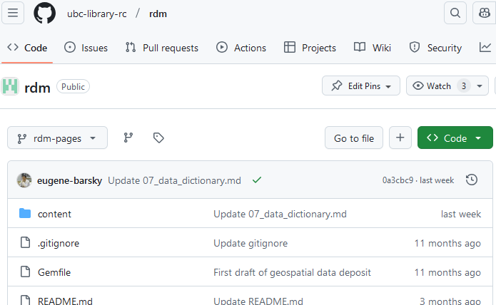
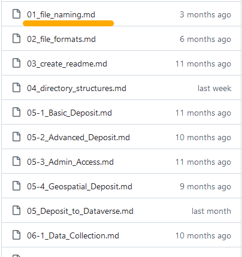

<!-- .slide: data-transition="fade-in slide-out" data-background-color="#CFECEC" -->
## UBC Library Research Commons

A multidisciplinary hub supporting research endeavours, partnerships, and education <!-- .element: class="fragment semi-fade-out" data-fragment-index="1" -->

Workshops developed and presented by librarians and graduate academic assistants (GAAs) <!-- .element: class="fragment" data-fragment-index="1" -->

notes: I'll start by briefly introducing the UBC Library Research Commons, where Eugene and I work. It's a multidisciplinary hub that supports faculty and students through workshops and consultations that help develop research-enabling skills. Our materials are developed with an audience of graduate studens and faculty members in mind, though anyone is welcome to attend. 

The Research Commons developed out of a peer support model, with many of its services offered by graduate students. Graduate Academic Assistants (GAAs) continue to be involved in many Research Commons activities. Each librarian in the Research Commons has their own area of focus - mine is Data Analysis and visualization, for example, and Eugene's is Research Data Management. And each librarian is paired with a GAA who collaborates on workshops.

---
### Distributed development 

- Many perspectives -> better content <!-- .element: class="fragment" -->
- Student employees = high turnover <!-- .element: class="fragment" style="color:#7E3517" -->
- Hard to remain consistent <!-- .element: class="fragment" style="color:#7E3517" -->


notes: The result is a fairly distributed developent environment, with several small teams in the Research Commons working semi-autonomously toward the broader Research Commons goal.

In my opinion this collaborative model works well for us. Incorporating the perspectives, skills, and insights of GAAs who come from many academic backgrounds has improved our content overall. But this approach also introduces some challenges.

An obvious challenge is that graduate student involvement usually means higher turnover as students come and go. Even if some GAAs stay with the Research Commons longer, in any given year there is almost guaranteed to be turnover.

Onboarding new students requires coordination as each new persong brings their own skills and preferences to the table - to say nothing of the preferences and habits of the _librarians_ they work with. Before the coordinated OER vision we adopted in 2020 there was much less consistency in how we developed and presented our material.

---
### The OER vision

- Open and reusable
- Collaborative development
- Consistent presentation
- Free tools & open formats
- Markdown for content

notes: In 2019 and 2020 a reorganization of the UBC Library Research Commons led to a new vision for our workshops and supporting materials. We took inspiration from the Carpentries and developed our workshops as Open Educational Resources (OERs) that are freely available, and published with a Creative Commons liense that encourages reuse. We liked the collaborative development model we already had but came up with workflows that brought more consistency to the way we present our workshops, as some of you may have already experienced in our workshop websites. And our goal was to do this using free and open tools that are available to anyone, regardless of library or university affiliations. We hoped this would lower barriers to access and remixing, but it also encouraged us to adopt more flexible and sustainable authoring habits. Most of our websites and presentations slides are now written in markdown, so that the content lives in relatively simple text files that can be rendered in different contexts. 

---
### Chosen software/platforms
<br/>

| software | function |
| --- | --- |
| Git | _version control_ |
| GitHub | _collaboration/distribution_ |
| GitHub Pages | _presentation (webpages)_ |
| reveal.js | _presentation (slides)_ |

notes: These are the software and platforms we adopted for developing the OERs. Their selection was to some degree opportunistic - someone on our team had already used these tools to develop and publish workshop materials, so we had some knowledge to build on. 

We use git for version control, which means we can re-write and update content without worrying about accidentally removing or overwriting something important, since we can always roll back to previous versions. 

GitHub is a convenient platform for collaborating and sharing content, and one that many on our team already have experience with. It's also great for publishing: With GitHub Pages we can present each repository as a standalone website at no extra cost.

And slides like the ones you see today are developed using reveal.js, which makes it easy to share presentations with only a browser, to integrate slides into workshop websites, or to reuse the content elsewhere. 

This list of software is by no means the only way to accomplish these tasks...

---
<!-- .slide: data-transition="slide-in fade-out" -->
### Rationale

- Strengthen team's skills
- Content in plain text files 
- No software costs
- Better workflow management
 
notes: ...but there are a few reasons why it was a good fit for us. The first listed here is to strengthen the team's skills so we can provide better support in consultations with researcher. Writing in plain text files aligns with the values of flexibility, platform-independence, and sustainability. Our markdown content is easily moved, remixed, and repurposed. It's also a workflow that's entirely free for our use case.

And perhaps most important of all, these tools set us up for much better content management. This includes ownership of material, collaboration within and across teams, and maintenance workflows. 


---
<!-- .slide: data-transition="fade-in slide-out" data-background-color="#CFECEC" -->
## The workflow

notes: So what does this actually look like in practice? How does an author on the Research Commons team go from markdown files to a published OER?

---
        <div style="width: 28%; font-size: 0.8em; padding: 2%; text-align: left; position: relative; float: left">
		  <h3>Setup</h3>
          <ul> 
			<li>GitHub account for each contributor</li>
			<li>GitHub <em>organization</em> for Research Commons</li>
          </ul>
</div>

        <div class="fragment" style="width: 28%; font-size: 0.8em; padding: 2%; text-align: left; position: relative; float: left">
          <h3>Content</h3>
          <ul>
		  <li>Markdown</li>
		<li>HTML/CSS <br/><em>(optional)</em></li>
          </ul>
		  </div>


        </div>
        <div class="fragment" style="width: 28%; font-size: 0.8em; padding: 2%; text-align: left; position: relative; float: left">
          <h3>Skills</h3>
          <ul>
			<li>Markdown <em>(everyone)</em></li>
			<li>Git/GitHub <em>(everyone)</em></li>
			<li>GitHub Pages <em>(someone)</em></li>
          </ul>
		</div>


notes: The requirements for our workflow are relatively simple. GitHub is the only platform that's a must. Each person who will contriubute to or manage the content should have their own GitHub account.

We gather the individual accounts under a GitHub organization, which makes it relatively easy to add or revoke rights as collaborators come and go. All our repositories are "owned" by the organization, not by individual acconts.  

The workshop source material is written in Markdown. In some contexts it can be helpful to enhance the Markdown with html and even CSS. This is optional but can provide more flexibility in how the content is presented.

The skills required for authoring content are familiarity with Markdown and GitHub. That's a relatively low barrier but those skills aren't universal and getting the whole team comfortable with the tools can take some work.

In additon to the basic authoring skills, someone on the team will need to understand how GitHub Pages works, but that can be just one person to handle the theme and configuration options.</p>

---

From Markdown content...

```markdown

# Why is file naming important?
{: .no_toc }

<p style="margin-top:20px;margin-bottom:25px">
Creating a well-organized hierarchy of files with clear naming conventions is an important part of improving your research process. This is especially important if you are working with large data sets and complex output files or coordinating with multiple people at multiple institutions. There are many ways to structure your folders, and multiple naming conventions you can use. The key is <b>consistency</b>. Make your file names descriptive, and include information about dates and versioning. The best practice is to consult with your lab or with your co-workers to develop a naming schema that everyone is willing to follow consistently.
</p>

Looking for a cheat sheet? Check out our <a href="https://osf.io/pfweq" target="_blank">one-pager</a>!
{: .note}

<details open markdown="block">
 <summary>
   Table of contents
 </summary>
 {: .text-delta }
- TOC
{:toc}
</details>

 ---

What do you think about the following file names?
- 10_data 2.txt
- figure 1.png
- final revision.docx
- Lily's schedule&plan 2022Jul9.xlsx

```

<span>Excerpt from <https://github.com/ubc-library-rc/rdm/blob/rdm-pages/content/01_file_naming.md></span> <!--.element: style="font-size:24px; font-style: italic; opacity: 0.8" -->


notes: Here's an example of a Markdown file for the front page of an RDM workshop about file naming. You might also notice that there's some html mixed in, which can be used for some needs that aren't met by standard Markdown. When rendered using GitHub pages, this exact markdown...

---
<!-- .slide: data-background-iframe="https://ubc-library-rc.github.io/rdm/content/01_file_naming.html" data-backround-interactive data-background-transition="zoom" -->

...to published workshop site <!-- .element: style="position: absolute; left: 65%; top: -300px; width: 30%; color: white; background-color: grey; opacity: 0.8; font-size: 0.8em" -->

          
notes: ...becomes this website for a file naming OER created by Eugene and the GAAs he works with. The layout is simple and consistent, with visual elements common to all Research Commons workshops, including the navigation menu on the left. 

---
<!-- .slide: data-auto-animate data-transition="none" -->
Each workshop/series is a GitHub repository

 <!-- .element: class="fragment fade-in-then-semi-out" data-fragment-index="1" -->

 <!-- .element: style="position: absolute; left: 55%; top: 15%" class="fragment" -->


notes: Each OER we publish in this way has its own GitHub repository in the Research Commons GitHub organization.
Here's a snapshot of the repository for the File Naming workshop. At the top level is a "content" directory...

...that contains several markdown files. Each file corresponds to one page on the OER website.

---
<!-- .slide: data-transition="fade-in slide-out" -->

Website theme in its own GitHub repository


<span>The Research Commons uses a modified version of the [Just the Docs](https://github.com/pmarsceill/just-the-docs) Jekyll theme</span> <!-- .element: style="font-size:24px; font-style: italic; opacity: 0.8" -->

Notes: GitHub pages uses software called Jekyll to generate websites from a repository. The instructions for converting these markdown files into a website are in what's called a Jekyll theme. In the Research Commons workflow we maintain a customized Jekyll theme in its own repository. This improves consistency across our workshop sites and makes updates and upgrades easier. Every one of the OER repositories points to the Jekyll theme when it gets rendered as a website.

---

<!-- .slide: data-transition="slide-in none-out" -->

Applying theme to workshop sites: **config.yml**

```yaml <!-- .element: class="fragment" -->
title: Intro to Docker
remote_theme: ubc-library-rc/rc-workshop-template
github_repo_url: "https://github.com/ubc-library-rc/intro-docker/"

# license information for workshop content
license_name: "Creative Commons Attribution 4.0 International License"
license_url: "http://creativecommons.org/licenses/by/4.0/"
license_image_url: "https://i.creativecommons.org/l/by/4.0/88x31.png"

# required for building jekyll site locally
plugins:
- jekyll-remote-theme
- jekyll-seo-tag
```

Notes: The link between the content repository and the theme repository is established in the config yaml file.

The _remote theme_ line points to our theme repository,  and is all that's needed to link the workshop repository to the theme. The config file also contains copyright information, which can be set for each workshop and is incorporated into the published site.

---
<!-- .slide: data-transition="fade" -->
<span>Instructions and documentation<br/>
<https://ubc-library-rc.github.io/rc-workshop-template/></span> <!-- .element: style="margin-top: 30px; font-size:smaller"> -->

Notes: A challenge with any workflow in a team environment is getting everyone on board, doing things in roughly the same way. To help with this the Research Commons theme repository is itself rendered as a GitHub pages site with step-by-step instructions for workshop authors.

---
<!-- .slide: data-transition="fade-in slide-out" -->
### Improvement and maintenance

- Coordinated content review 
- _GitHub Issues_ for specific changes
- _Pull requests_ for community contributions

notes: As a platform, GitHub also has affordances that help us when improving and maintaining our content. It's easy to do content review collaboratively without stepping on each others' using git branches, for example. GitHub issues is designed to track software development and bug fixes, but works just as well to keep track of suggested improvements or wishlists for our content. And through pull requests we can welcome contributions from anyone who has a GitHub account and an interest in making our resources better.

---
<!-- .slide: data-transition="slide-in fade-out" -->
### Does it work? A reality-check
<div class="fragment" style="float:left; font-size: 0.8em; margin: 0 3%; width:42%; position: relative">
<h3 style="color: DarkGreen">Pros</h3>
<ul>
<li>Skill development</li>
<li>Sustainable formats</li>
<li>Consistent presentation</li>
<li>Community contribution</li>
<li>Preserve content history</li>
</ul>
</div>
<div class="fragment" style="float:left; width:42%; margin: 0 3%; font-size: 0.8em; position: relative">
<h3 style="color: DarkOrange">Cautions</h3>
<ul>
<li>Steep learning curve</li>
<li>Dependent on GitHub</li>
<li>Requires upkeep</li>
</ul>
</div>

notes: Before handing things over to Eugene I want to share some of my own reflections about this setup. After several years, does the implementation live up to the promise? 

On the whole I would say yes, but with a few cautions. 

Pros:
Skill development is a big advantage, in my opinion. I had used both git and GitHub before, but not often enough for it to feel like part of my work... this workflow was a nudge that increased my sophistication in some of these tools. It can also present a valuable learning opportunity for the GAAs we hire. 
I won't read through all the other pros because I spoke about many of them before, but I'd like to reinforce that our workflow has delivered on many of these promises. I would choose a very similar set of tools if setting up something like this again elsewhere. 

Cautions: 
But there are some things it's important to consider. The learning curve can be steep, especially if you're interested in customizing the Jekyll template or creating more sophisticated slides with reveal.js. Members of the team will likely need to commit to learning new tools, which can be discouragingly slow at first. One caution is our dependence on GitHub, the only software in the chain that isn't open source (despite its role in open source development). It's always possible that GitHub will change its services or features in a way that disrupts our setup, though we don't anticipate this in the near term. And my last comment is really just a reminder to check your rose-coloured glasses: any process requires upkeep. The workflow we use for OERs improved consistency and access to our materials, but the collection still needs pruning and care - something that I think Eugene does a great job with in his own OERs.   

---
<!-- .slide: data-transition="fade-in slide-out" data-background-color="#CFECEC" -->
## Research Data Management OERs
